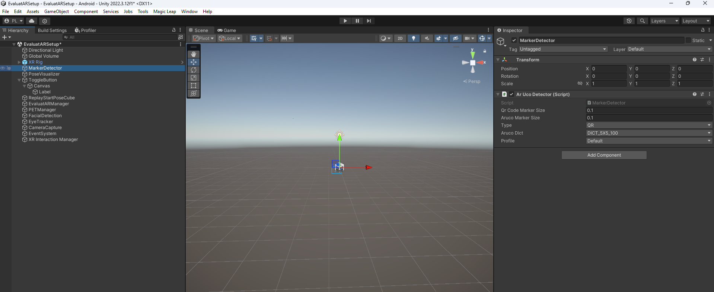
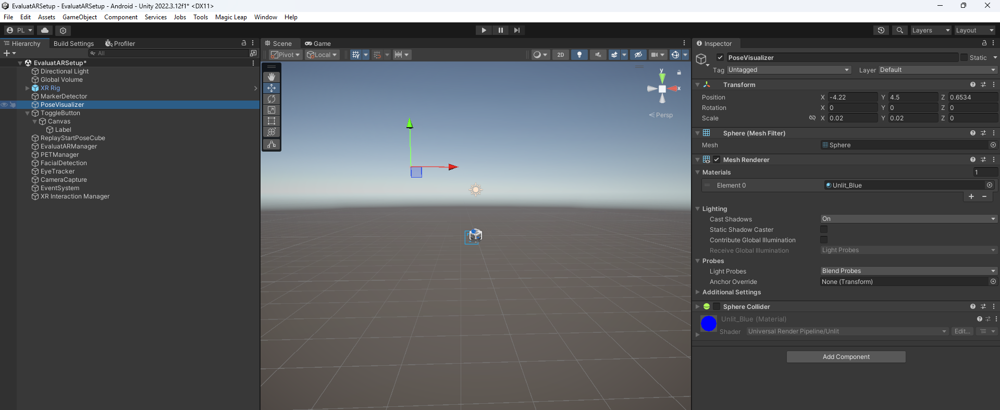
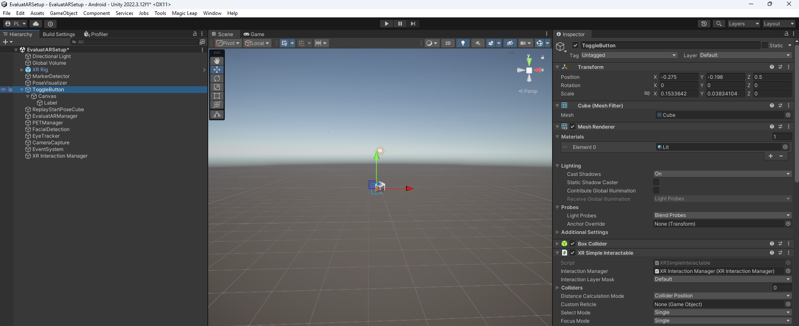
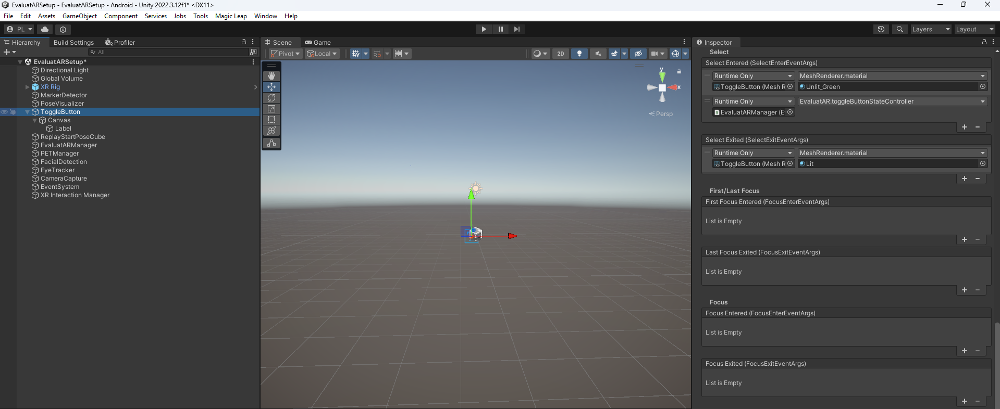
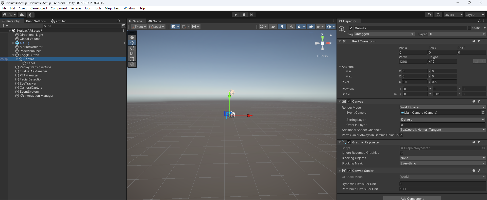
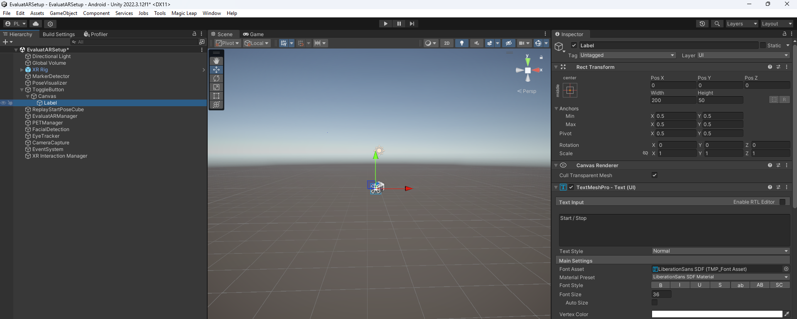
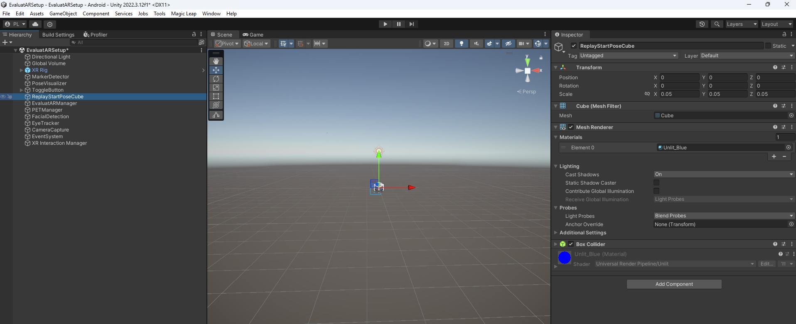
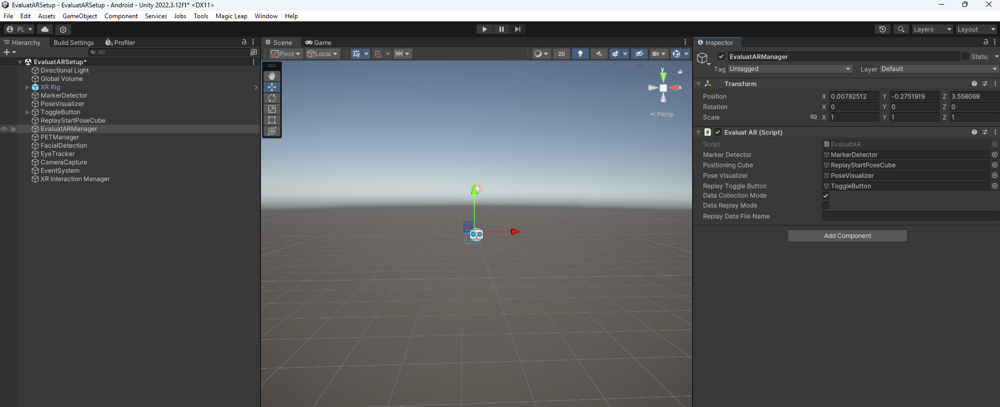

# EvaluatAR Artifact

This artifact accompanies the paper **EvaluatAR: A Cross-Device Evaluation Framework for Rapid Prototyping of Bystander PETs in AR.**

**What to focus on:** the core framework is implemented in a single, modular Unity/C# script: **`EvaluatAR.cs`**.  
The other folders are **reference instantiations** (case-study integrations).

---

## Requirements

- **Unity:** tested with **Unity 2022.3.12f1**.
- **Python (for analysis script):** tested with **3.9.20**.

---

## Unity Scene Setup

### Step 1 - Add a QR detector to your project
1. Create a GameObject, e.g., `MarkerDetector`.
2. Attach your marker detection script/component.



### Step 2 - Create the pose visualizer
1. Create a 2D circular GameObject: `PoseVisualizer`



### Step 3 - Create the replay toggle button (virtual UI)
1. Add a **Button** (or Toggle)
3. Hook the button's `OnClick()` to EvaluatAR’s public methods:
   - `EvaluatAR.toggleButtonStateController()`






### Step 4 - Create the positioning cube
1. Create a Cube: `ReplayStartPoseCube`
2. Make it visually distinctive (e.g., wireframe/material) but unobtrusive.



### Step 5 -  Add and configure EvaluatAR
1. Create an empty GameObject, e.g., `EvaluatARManager`.
2. Copy `Artifacts/EvaluatAR.cs` into your Unity project (e.g., `Assets/Scripts/Framework/`).
3. Attach `EvaluatAR.cs`.
4. In the inspector (or in your init script), assign references:
   - `MarkerDetector`
   - `PositioningCube`
   - `PoseVisualizer`
   - `ReplayToggleButton`

EvaluatAR is intended to run in one of two modes:
- **Data Collection Mode**: logs per-frame *inputs* for later replay.
- **Data Replay Mode**: serves per-frame *replayed inputs* to the PET and logs per-frame *PET outputs* + performance stats.

If you are running the application in replay mode, then specify the file's name in the respective field as well. Otherwise, leave it blank.



### Step 7 - Integrate EvaluatAR script into your PET
Your PET's main script should expose any sensor/context streams that your PET consumes. It should also integrate the EvaluatAR's hooks to pass data to it (as specified in the paper)

---

## Analysis Environment Setup

### Step 1 - Clone the Repository

```bash
git clone https://github.com/SIMSB-99/EvaluatAR.git
cd EvaluatAR
```

### Step 2 - Set Up And Activiate A Local Environment

#### Option A: Using Anaconda 

```bash
conda create --name project-env python=3.9.20 -y
conda activate project-env
```

#### Option B: Using Python venv

```bash
# Windows
python -m venv venv
# (Command Prompt)
venv\Scripts\activate.bat
# (PowerShell)
.\venv\Scripts\Activate.ps1

# macOS/Linux
python3 -m venv venv
source venv/bin/activate
```

### Step 3 - Install Dependencies
```bash
pip install -r requirements.txt
```

### Step 4 - Run the **`Analysis.ipynb`** file

---

